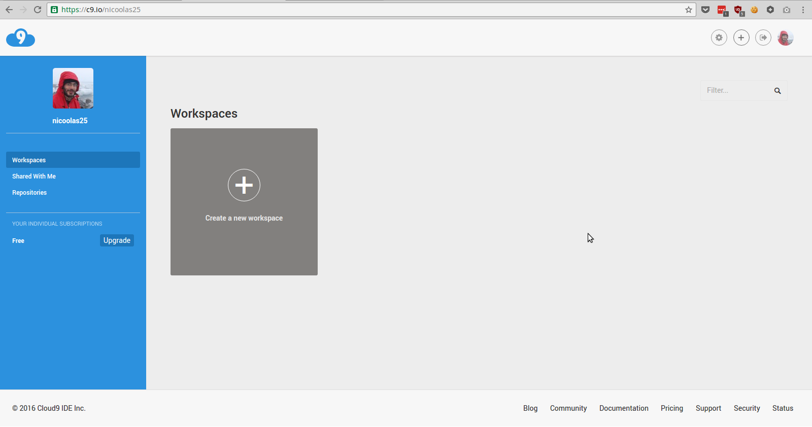
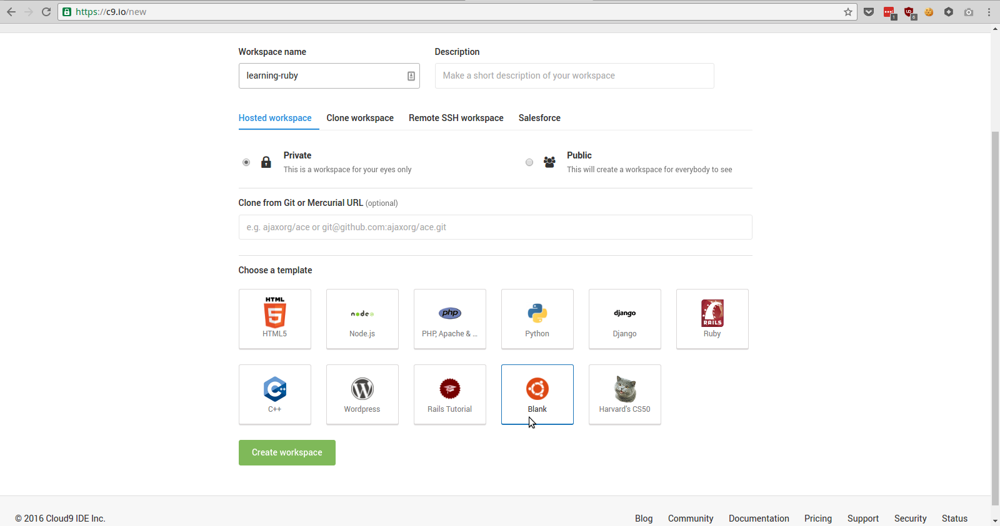
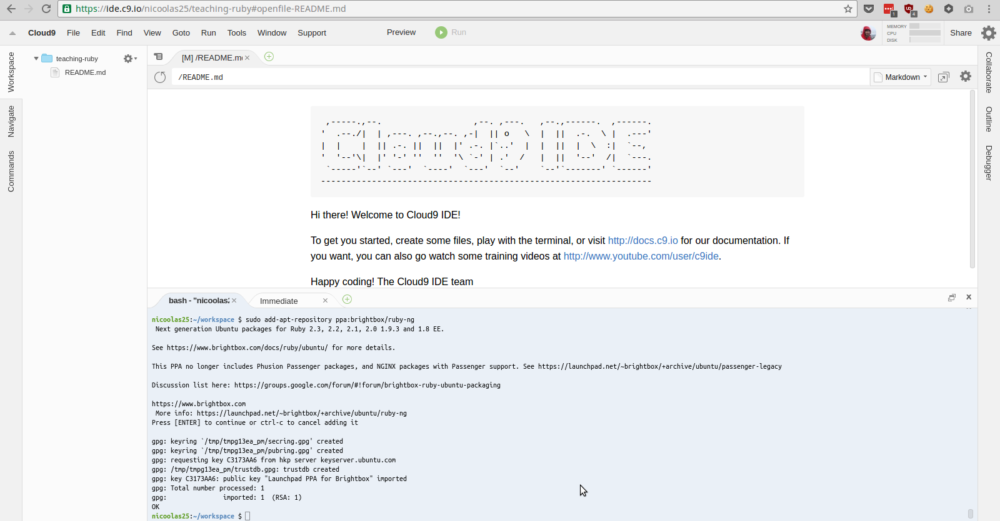
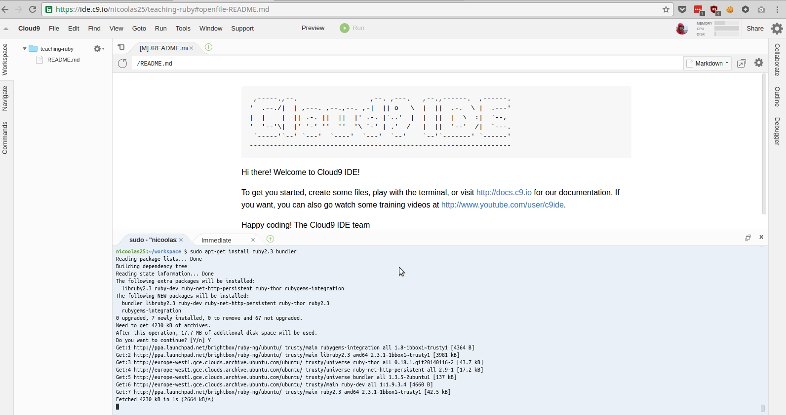
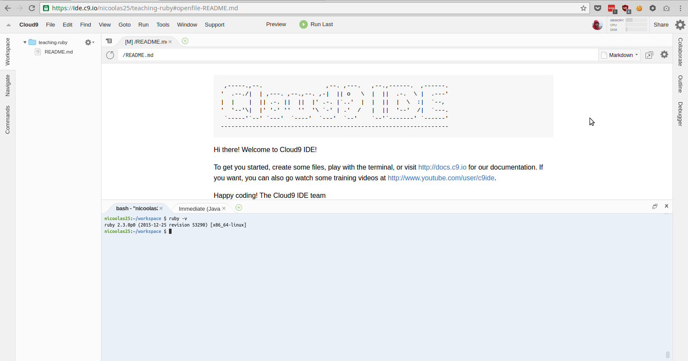

# Setup a development environment

Depending on your level, you'll be able to get a code editor like
[Sublime Text][sublime] and [MRI][dl-ruby] by yourself. If you feel
confortable with that then you can skip this chapter.

For the others that are still there, we can use [Cloud9][cloud9], a
development environment hosted on Cloud9 servers. It is especially
easy for me to assume that you have this exact environment.

## Registering at Cloud9

The first step is to sign up for a free account on Cloud9. Of course,
no credit card is required. Once it is done, you should be able to access
your _cloud9 dashboard_ (see the picture below).

> virtual machine, integrated development environment

## Creating a workspace

Now, you'll need to create a _workspace_ with the following settings:

* _name_ it whatever you want, `learning-ruby` in the picture,
* choose to have a _private_ workspace, and
* start with a _blank_ workspace.

It takes a few seconds to create the workspace, once it's done, you should see it.

## Understanding what you see

I assume you are now in front of your newly created workspace. We'll see some
details about what you have here very soon. Don't hesitate to explore, there is
nothing to break here.

### The file manager panel (1)

On the left, you have the list of the files present in your workspace. During this
tutorial, we'll create files containing source-code, aka programs. Those files
will show up in the file manager.

You can try right now to create a file either with the `File` menu right on top
of the file manager or by using the `Alt-N` shortcut. When you create a new file,
it has no name. To actually create it, you have to save it either by using the
`Save` item in the `File` menu or by using the `Ctrl-S` shortcut. When you save
a file, you'll be prompted for a folder and a filename. Lets use `hello.rb`, it
will become our playground later on...

### The preview tab (2)

The preview tabs start with a `[P]`. When the workspace starts, you have the
preview of the `README.md` file that is here by default.

If you look on the file manager on the left and double-clic on the `README.md`
a new tab will appear with the content of the file, allowing you to edit the
content of the file. _Source-codes are just plain text files._

If you change the text in the `README.md` tab and save it (`Ctrl-S`) you can
check that your changes are visible in the preview tab: `[P] README.md`.

> code editor, sublime text, vim, emacs

### The terminal tab (3)

This [terminal][terminal] tab is probably the most useful of all, it allows you to
operations like installing new software, running Ruby code, finding files, etc.

I'll always explain when we have to use it, why, and what we'll be doing exacly.
If you're curious, know that this terminal is a running program like the one
you'll write soon. This program is called [bash][bash] and there is tons of
resources online to teach you more about it!

> shell, command line interface, terminal

## Installing Ruby

To install Ruby, we'll use a special repository which is not enabled by default.
A repository, in the context of installing new software, is like a directory
telling your computer what software is provided.

The first step is to add a repository containing a fairly up to date version of
Ruby. To do so we'll be using the terminal to:

* Add the repository: `sudo add-apt-repository ppa:brightbox/ruby-ng`
* Update the software directories: `sudo apt-get update`

* Install Ruby: `sudo apt-get install ruby`

### What did you just do (optional)

You just copy / paste some cryptic commands from this tutorial and you don't
understand what happened? It's not that important right now so you can skip this
paragraph if you want.

Here are the _commands_ you've seen: `sudo`, `add-apt-repository`, and `apt-get`.
The other parts like `install ruby`, `update`, and `ppa:brightbox/ruby-ng` are
the _arguments_ of those commands.

The `sudo` command is for `SUperuser DO`. It does something as _superuser_. Ok,
what is a superuser then? A machine can have different users: maybe your son,
your husband or a guest. Not all of them can do everything on the computer. For
instance, you may not want your guest installing new software without asking.
A superuser is someone that can access all the files of the computer, install
new software, etc.

The `add-apt-repository` is for adding a new source for finding and installing
software. After adding such a source, you have to update the list of available
software to install. It's why the `apt-get update` came right after it.

Finally `apt-get install ruby` is asking the `apt-get` program to install Ruby.
Here `ruby` is the name of a software _package_ found in the repositories' lists.

> package management system, linux sudo, ubuntu ppa

## Check that everything work

One last step to be sure that your environment is setup. We'll ask Ruby for its
version with the command: `ruby --version`. If everything went as expected, Ruby
should answer you that you have the vestion `2.3.x`.

If anything seems a bit different, just ask someone around!

[sublime]: https://www.sublimetext.com/
[dl-ruby]: https://www.ruby-lang.org/en/downloads/
[cloud9]: https://c9.io/
[bash]: 
[temrinal]: 
