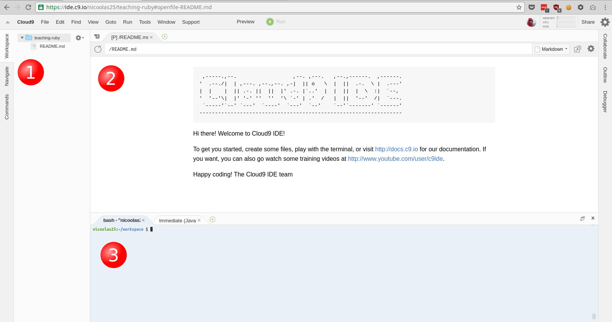

# Setup a development environment

Depending on your level, you'll be able to get a code editor like
[Sublime Text][sublime] and [MRI][dl-ruby] by yourself. If you feel
confortable with that then you can skip this chapter.

For the others that are still there, we can use [Cloud9][cloud9], a
development environment hosted on Cloud9 servers. It is especially
easy for me to assume that you have this exact environment.

## Registering at Cloud9

The first step is to sign up for a free account on Cloud9. Of course,
no credit card is required. Once it is done, you should be able to access
your _cloud9 dashboard_ (see the picture below).

## Creating a workspace

Now, you'll need to create a _workspace_ with the following settings:

* _name_ it whatever you want, `learning-ruby` in the picture,
* choose to have a _private_ workspace, and
* start with a _blank_ workspace.

It takes a few seconds to create the workspace, once it's done, you should see it.

## Understanding what you see

I assume you are now in front of your newly created workspace. We'll see some
details about what you have here very soon. Don't hesitate to explore, there is
nothing to break here.

### The file manager panel (1)

On the left, you have the list of the files present in your workspace. During this
tutorial, we'll create files containing source-code, aka programs. Those files
will show up in the file manager.

You can try right now to create a file either with the `File` menu right on top
of the file manager or by using the `Alt-N` shortcut. When you create a new file,
it has no name. To actually create it, you have to save it either by using the
`Save` item in the `File` menu or by using the `Ctrl-S` shortcut. When you save
a file, you'll be prompted for a folder and a filename. Lets use `hello.rb`, it
will become our playground later on...

### The preview tab (2)

The preview tabs start with a `[P]`. When the workspace starts, you have the
preview of the `README.md` file that is here by default.

If you look on the file manager on the left and double-clic on the `README.md`
a new tab will appear with the content of the file, allowing you to edit the
content of the file. _Source-codes are just plain text files._

If you change the text in the `README.md` tab and save it (`Ctrl-S`) you can
check that your changes are visible in the preview tab: `[P] README.md`.

### The terminal tab (3)

## Installing Ruby

## Check that everything work

[sublime]: https://www.sublimetext.com/
[dl-ruby]: https://www.ruby-lang.org/en/downloads/
[cloud9]: https://c9.io/
