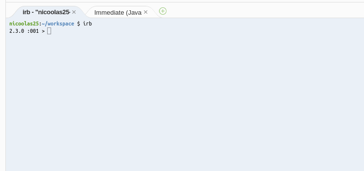

# The evaluation of expressions

One fundamental thing in programming is understanding what an expression is,
what they could do. In a minute we'll start playing with expressions in you
environment.

A programming language is made of _syntaxic_ and _semantic_ rules. Knowing
the rules and using them to instruct the computer is _programming_.

The syntaxic and semantic rules of Ruby are stated in the [ISO specification][ruby-iso].
It's not intended for beginners. If you're interested, I'll be happy to give you
some advice about how to read such a document outside of this tutorial.

## Syntax

The syntax states what you can write, what the Ruby interpreter will be
able to _read_. Lets have a look at some basic rules to give you a gasp
of what it looks like.

```
unprefixed-decimal-integer-literal ::
    0 | decimal-digit-except-zero ( _? decimal-digit )∗

decimal-digit-except-zero ::
    1 | 2 | 3 | 4 | 5 | 6 | 7 | 8 | 9

decimal-digit ::
    0 | 1 | 2 | 3 | 4 | 5 | 6 | 7 | 8 | 9
```

Here we have 3 rules:

* `unprefixed-decimal-integer-literal`:
  * `0` or (`|`),
  * a `decimal-digit-except-zero` followed by 0 or more times (`*`):
    * an optional (`?`) `_` followed by a `decimal-digit`.
* `decimal-digit-except-zero`:
  * `1` or `2` or `3` or `4` or `5` or `6` or `7` or `8` or `9`
* `decimal-digit`
  * `0` or `1` or `2` or `3` or `4` or `5` or `6` or `7` or `8` or `9`

To sum this up, the syntax tells you that this sequences are valid
decimal integer literals: `1000`, `1_012`, `1_0_1_2` but these one
shouldn't be: `09`, `1__012`.

## Semantic

If the syntax rules tell you how to write, semantic rules tell you what is
the _meaning_ of what you write. Lets have a look a semantic rule related to
the syntax rule we've just seen.

> The value of a _unprefixed-decimal-integer-literal_ is 0 if it is of the form `0`, otherwise the value
> of the _unprefixed-decimal-integer-literal_ is the value of a sequence of characters, which consist of
> a _decimal-digit-except-zero_ followed by a sequence of _decimal-digits_, ignoring interleaving `_`s,
> computed using base 10.

This semantic rule is in plain English. It's all about the _value_ of an
`unprefixed-decimal-integer-litteral`. This emphasis the fact that regarding
the syntax rule only, a sequence of digits is just a sequence of digits,
nothing more!

You would expect a sequence of digits to be a number, of course. The semantic
rule is here exactly for explaining how the sequence of digits is understood by
Ruby. Restating the semantic rule from the ISO specification would be something
like this:

> When you write a sequence of digits, not starting by zero, the value of this sequence
> will be the number composed by the digits, in base 10. You can add `_` inside without
> changing the meaning but to make it more readable.

_Evaluation_ is the process of applying syntaxic and semantic rules to an
_expression_, transforming a sequence of characters into a meaninful _value_.

## Diving in IRB: Interactive RuBy

When you installed Ruby, you also get a program called `irb`. This program is
a REPL: [read eval print loop][repl]. It means that it will wait for you to type
some Ruby expressions, evaluate them, display back the value of the expression to
you, and start waiting again for another expression.

If you type `irb` in a new terminal, an discussion will start between you and Ruby.



Here is an example of an _IRB session_:

``` bash
$ irb
```

```
2.3.0 :001> 2_000
=> 2000

2.3.0 :002> 2 + 3
=> 5

2.3.0 :003> "Hello Strings"
=> "Hello Strings"

2.3.0 :004> "Bob is turning #{25 + 1}!"
=> "Bob is turning 26!"
```

_I strongly encourage you to try to do thoses things in your own IRB session._

What just happened?

1. We wrote the expression `2_000`, and aksed IRB to evaluate it. The result was `2000`.
2. We wrote a more complex expression `2 + 3`, IRB evaluate it to `5`.
3. We wrote a expression using Ruby's syntax for writing _string litterals_.
4. This is a more advanced syntax: _string interpolation_.

## Errors

As we've seen, when you wrote to the IRB prompt, you wrote a list of characters.
This list is _read_ by Ruby following the _syntaxic rules_. These rules define
things such as:

* how to write litterals:
  * numbers, for instance `1000.0`, `1_000.0` and `1e3` are the same,
  * strings, for instance `'simple'` or `"double quotes"`,
  * arrays, for instance `[1, 2, 3]` but also empty arrays like `[]`, etc.
* the way you can add comments in the code,
* how to combine expressions, etc.

Remember that we said that `1__000` was a not valid Ruby syntax.
Lets try it anyway...

```
2.3.0 :002 >   1__000
SyntaxError: (irb):2: trailing `_' in number
1__000
  ^
(irb):2: syntax error, unexpected tIDENTIFIER, expecting end-of-input
        from /usr/local/rvm/rubies/ruby-2.3.0/bin/irb:11:in `<main>'
```

IRB didn't respond to us with the result of the evaluation but with an error. An
error is decomposed like this:

1. the _class_ of the error: `SyntaxError`,
2. the _place_ this error just happened: the second line of an IRB session ; `(irb):2`,
3. the _message_ related to the error: `trailing '_' in number`
4. an reminder of the exact place where something strange happened (optional).
5. the _backtrace_, starting with `from`. We'll talk more about backtraces later.

Basically what this error mean is that Ruby don't know how to read `1__000`.
In this case, we already know that Ruby isn't built to recognize this.

You'll have a lot of errors, especially while you're discovering Ruby's syntax.
Try to fully read and understand them, it will be of a great help. When you face
an error that you don't understand, you should ask arround.

[ruby-iso]: http://www.ipa.go.jp/files/000011432.pdf
[repl]: https://en.wikipedia.org/wiki/Read%E2%80%93eval%E2%80%93print_loop
